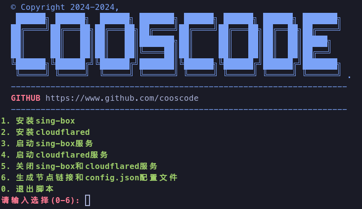

## About



简单易用傻瓜式在 `serv00` 免费服务器中创建 `vless`，`vmess` 节点

- 新增 `vless` 节点支持，欢迎 `fork` 和 `star`

## Usage

```sh
DIR=".$(openssl rand -hex 8)" && git clone https://github.com/cooscode/serv00-singbox.git "$HOME/$DIR" && bash "$HOME/$DIR/serv.sh"
```
## Tutorial

详见[教程](TUTORIAL.md)

## Q&A

- Q：关于 `singbox` 和 `cloudflared` 进程保活？

  A：不建议使用 `crontab` 命令设置周期调度命令，因为可能会覆盖掉其他命令，建议直接在网页中设置添加 `cron job`：
  
  ```sh
  @reboot /path/to/web run -c /path/to/vless_config.json
  @reboot /path/to/bot tunnel --edge-ip-version auto --no-autoupdate --protocol http2 run --token "TOKEN"
  ```
  
  如果你的 `cron job` 中没有其他进程，不用担心覆盖其他命令，可以使用如下命令：
  
  ```sh
  cat << EOF | crontab -
  @reboot /path/to/web run -c /path/to/vless_config.json
  @reboot /path/to/bot tunnel --edge-ip-version auto --no-autoupdate --protocol http2 run --token "TOKEN"
  EOF
  ```
- Q: vless_config.json 中的 wireguard配置 能否使用自己生成的密钥对
  A: 能，可以通过如下命令生成密钥对

  ```sh
  wg genkey > pri.key
  wg pubkey < pri.key > pub.key
  ```

## Disclaimer

> [!important]
>
> 1. 作者对任何使用此仓库的个人和团体进行的任何非法活动不承担任何国家国家的法律责任，使用该项目时产生的任何后果由使用者本人承担。
> 2. 作者不对任何个人和团体使用此仓库直接或间接导致的损害负责。
> 3. 使用者使用此项目即为完全同意本条及以上条款。

## Thanks

感谢以下开源仓库提供的灵感

[am-serv00-vmess](https://github.com/amclubs/am-serv00-vmess)

***Enjoy !!!***
