# TUTORIAL

## 一、文件夹目录

```
$HOME/.039cef99d03c521d/      项目文件夹
├── bin                       可执行文件文件夹
│   ├── bot                   cloudflared可执行文件（换了个名）
│   └── web                   singbox可执行文件（换了个名）
├── config                    配置文件夹
│   ├── NODE_INFO.txt         节点信息
│   ├── TOKEN                 cloudflared TOKEN
│   ├── UUID                  节点的UUID
│   └── vless_config.json     服务器端节点的json配置，如果是vmess则为vmess_config.json
├── img
│   └── ...
├── LICENSE
├── README.md
├── serv.sh                   配置脚本
└── TUTORIAL.md               教程
```

## 二、运行脚本

运行如下命令：

```sh
## 脚本运行完之后将自动创建由一串随机16进制数命名的文件夹，并将此项目克隆到此文件夹中
DIR=".$(openssl rand -hex 8)" && git clone https://github.com/cooscode/serv00-singbox.git "$HOME/$DIR" && bash "$HOME/$DIR/serv.sh"
```

如下所示：


## 三、安装 `singbox` 和 `cloudflared`

输入 `1` 安装 `singbox`，输入 `2` 安装 `cloudflared`

## 四、需要先配置节点才能启动服务

1. 输入 `6` 开始配置节点

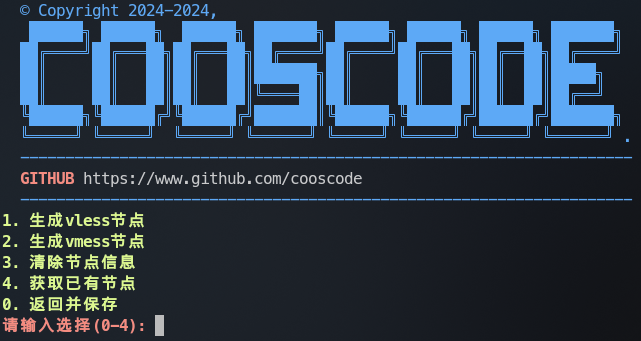

这里演示配置 `vless` 节点（`vmess`节点的配置和 `vless`节点的配置一模一样）

2. 输入 `1` 

3. 输入TCP端口号

   在服务器控制面板中添加一个开放的tcp端口号，默认即可，并填入服务器中

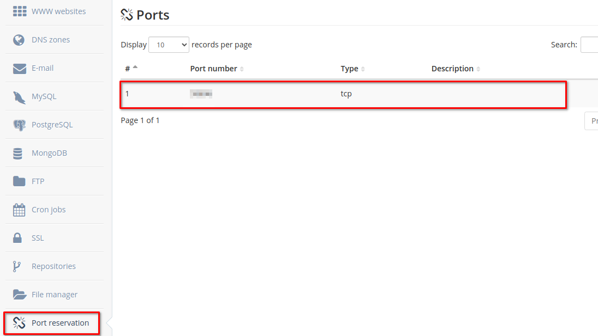

***有如下几种节点方案***

### vps ip + NO tls （裸机，此方式速度慢容易断连， NOT recommended）

> [!NOTE]
>
> UUID默认是系统自动生成的，并保存在UUID文件中，如果你把UUID文件删了，你再运行时，脚本又会自动生成新的默认UUID，可放心直接使用

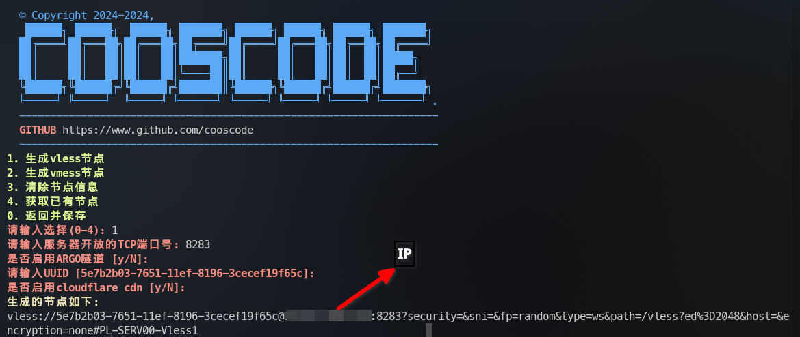

### vps ip + cf cdn（still NOT recommended）

先去CF官网设置cdn域名，你需要有自己的域名，可以自己在网上找免费域名的申请

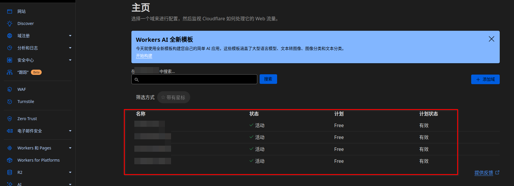

点击其中一个域名进入

先获取你的vps的ip地址，运行如下命令`curl --header "User-Agent: chrome" https://api.ip.sb/ip` 或者直接copy上面节点信息中的ip地址。

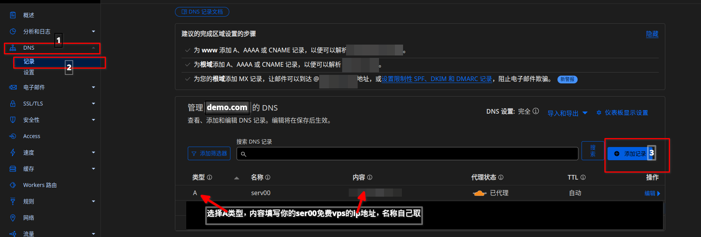

在下面填写cf cdn域名，例如，我的域名为 `demo.com`，我在上面添加了一个名称为 `ser00`并指向vps的ip地址的A记录，所以我在下面cf cdn域名中应填写 `ser00.demo.com`

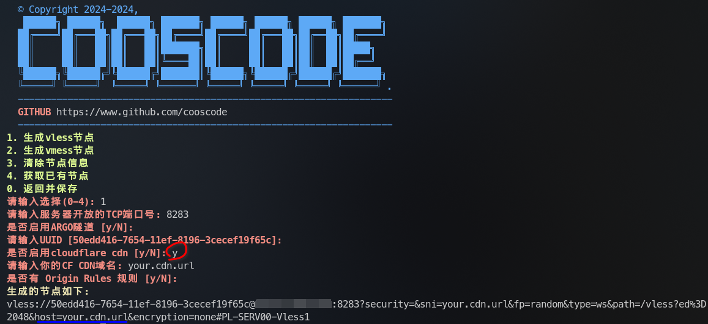

### 优选ip或域名+cf  cdn+tls或者优选ip或域名+cf cdn+NO tls（推荐使用tls）

在上面设置了cf cdn域名的基础上，你还需要如下设置——添加回源规则

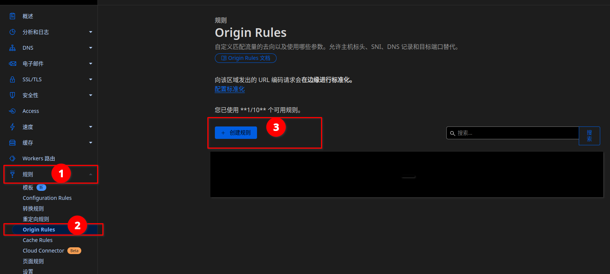

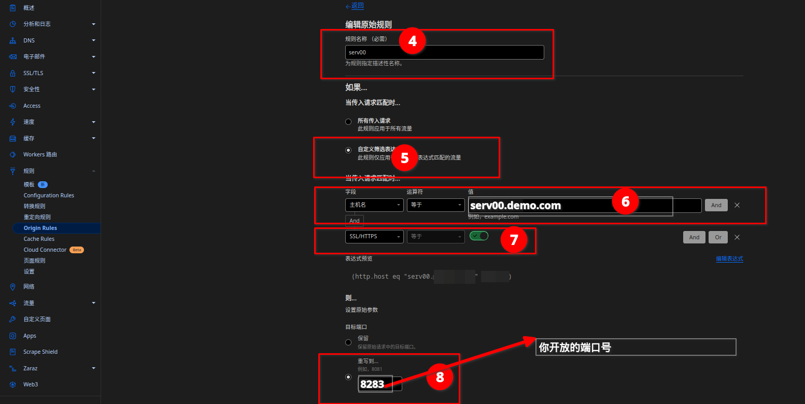

> [!NOTE]
>
> 如果你使用了`tls`，你就必须要勾选上面的步骤7的按钮，如果你不使用 `tls`，你就必须取消勾选步骤7的按钮。
>
> **上面设置完了，不要忘了点击部署**

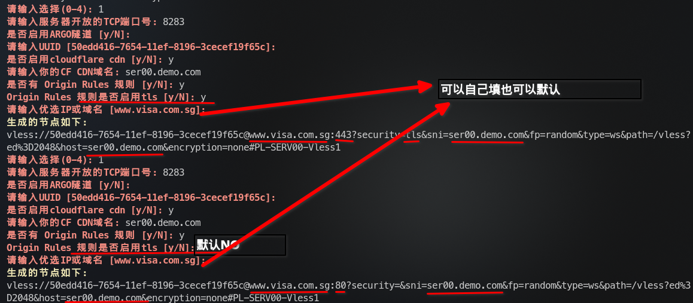

### 使用argo隧道（默认tls）

如果你只使用此节点方案，你不需要在cf中设置cdn域名，也不需要设置回源规则，但是你需要有自己的域名。你只需要老老实实按照下面方式设置

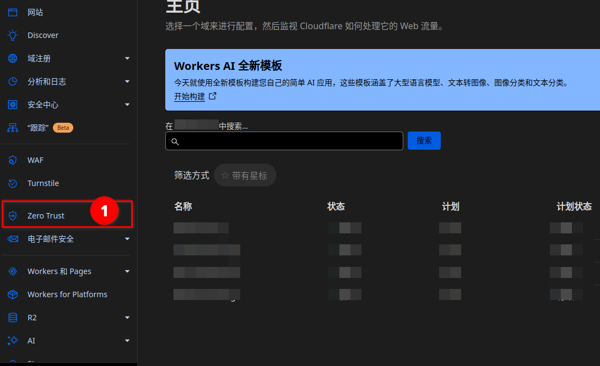

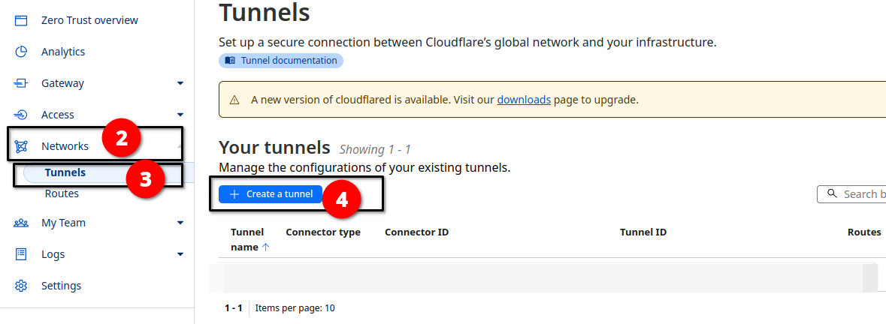

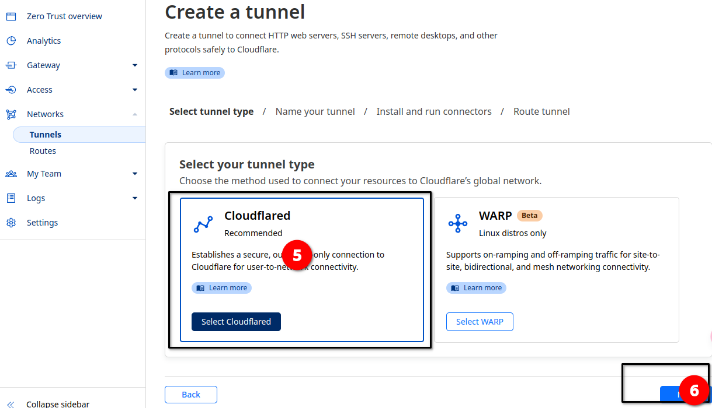

之后填写你的隧道名字，例如我填写的是`tunnel`，然后点击next

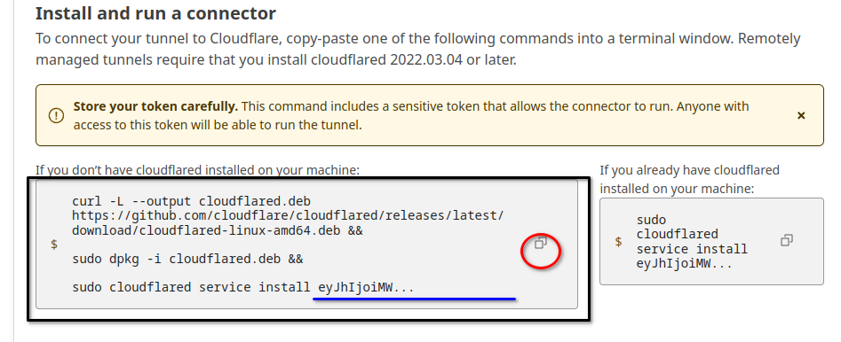

必须复制上面内容，上面蓝色横线的是TOKEN，创建节点时需要用到，然后点击next

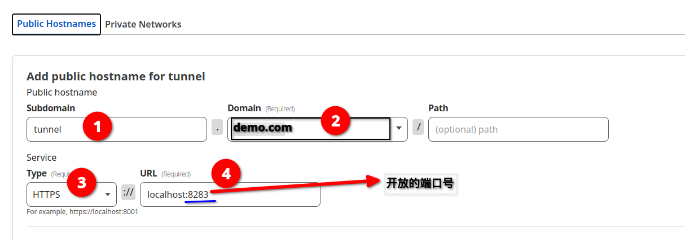

最后在脚本中填入：

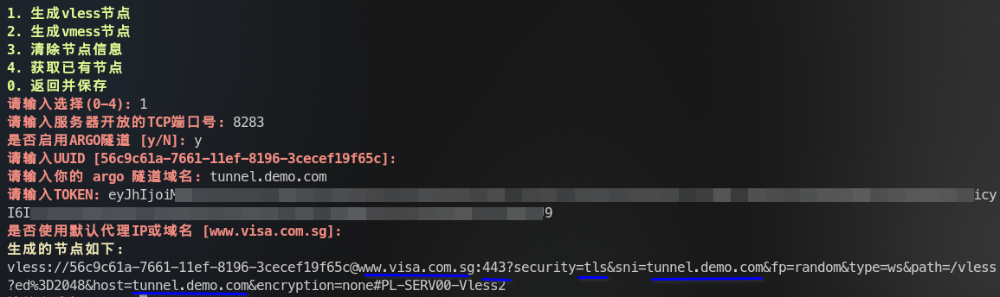

### 其他操作

输入4可以获取已有节点信息，输入3会清除节点信息，清除之后，你将无法获取节点信息。

### 保存

当你设置好节点之后，**必须**输入0保存，它还会问你是否保存，默认是N，如果你确定好就是使用这种节点方案之后输入y保存

如果你此前已经运行了singbox和cloudlared，它会重新启动singbox和cloudflared并覆盖此前的节点信息，如果你此前没有运行singbox和cloudflared，它也不会给你启动它们，你需要手动输入3启动sing-box，然后输入4启动cloudflared，如果你没有使用argo隧道，不用启动cloudflared，否则，必须启动它。

## 五、最后

输入0退出脚本。

可以运行命令 `ps aux`，查看singbox(web)或者cloudflared(bot)，是否在运行。

## 六、保活

因为ser00的免费vps，隔段时间会自动重启，如果你需要保活你运行的singbox和cloudflared，我建议你直接在vps的控制台中添加 `cron jobs`

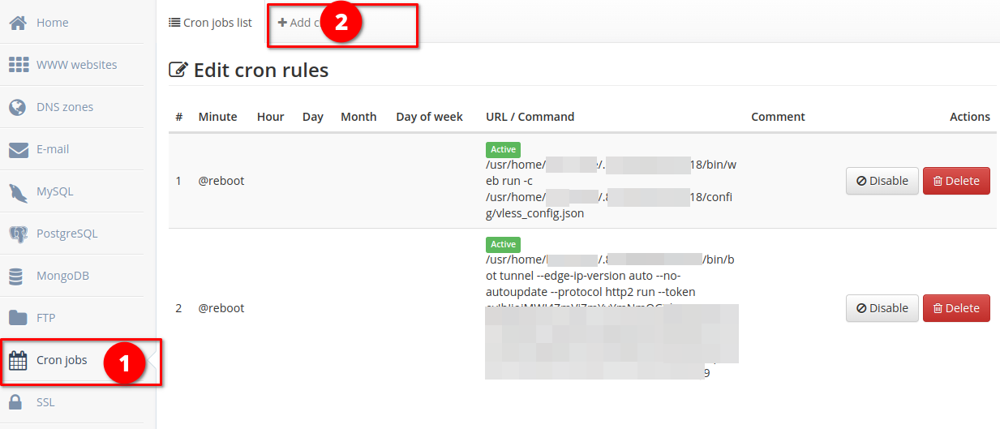

如果，你的`cron jobs`中没有其他内容，不用担心其他命令会被覆盖，可以使用如下命令：

```sh
cat << EOF | crontab -
@reboot /path/to/web run -c /path/to/vless_config.json
@reboot /path/to/bot tunnel --edge-ip-version auto --no-autoupdate --protocol http2 run --token "..."
EOF

## 上面请填写web，bot，vless_config.json正确的位置，以及正确的token值。
```

> [!NOTE]
>
> 注意，此命令会覆盖之前的 `cron jobs`，请谨慎使用。

